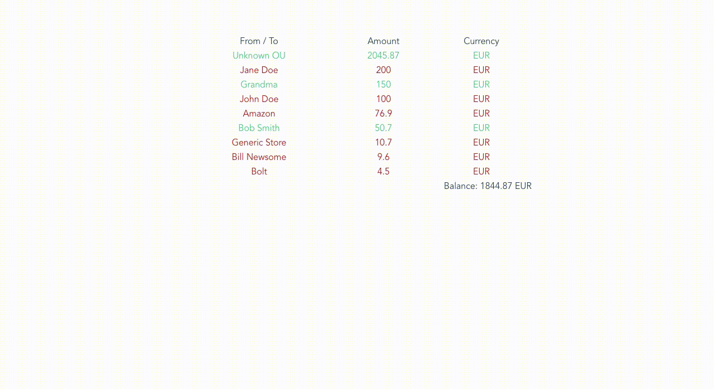

# WAD 2020 Exam 2: Project A

## Project setup
```
npm install
```

### Compiles and hot-reloads for development
```
npm run serve
```

# Setup

You will nee to [import](https://docs.github.com/en/free-pro-team@latest/github/importing-your-projects-to-github/importing-a-repository-with-github-importer) 
this repository to you GitHub account, to do that please follow these steps:
* Go to Github [import page](https://github.com/new/import)
  * **Note**: you have to be logged in to your GitHub account
* In the first field `"Your old repository’s clone URL"` enter URL of this repository `https://github.com/tsotnekekelia/wad20-exam2-a`
* In  the next field give it a name
* Make it **Private**
* And begin to import, it should take couple minutes
* Add me as a collaborator to your new repository, [click here](https://docs.github.com/en/free-pro-team@latest/github/setting-up-and-managing-your-github-user-account/inviting-collaborators-to-a-personal-repository)
 to learn how
  * My `email` and `username` on github is: `cotne.kekelia@yahoo.com` and `tsotnekekelia`


# Tasks

Modify [Transactions.vue](./src/components/Transactions.vue)
 so that it displays all the transaction objects that are passed to it from [App.vue](./src/App.vue)

1. Display From/To, amount and currency of each transaction _**[5 points]**_
2. Have a **computed property** called `sortedTransactions` 
that sorts received list by amount (largest to smallest by default) _**[6 points]**_
3. Have a **computed property** called `balance` that calculates 
total (adds amount of a transaction if `type` is `income`, 
subtracts if `type` is `spending`) and display it in the `span`
 element that has the **id** `balance` _**[6 points]**_
4. On click on the Amount label (element with id `amount-label`) 
toggle order of the list by amounts, from largest to smallest and vice versa _**[5 points]**_
5. Color the text in the row of a transaction to green if 
transaction `type` is `income` and red if it is `spending` _**[3 points]**_

Your app should look something like this:


